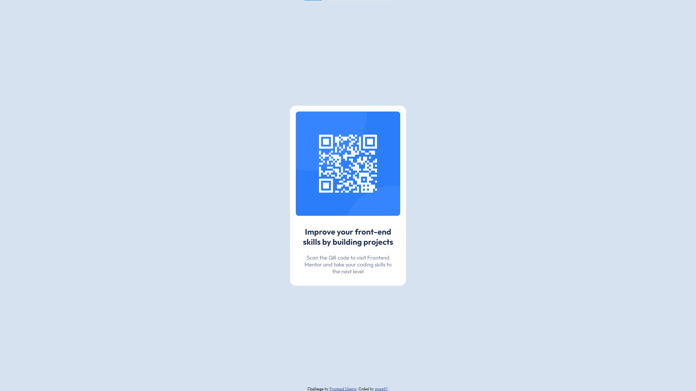

# Frontend Mentor - QR code component solution

This is a solution to the [QR code component challenge on Frontend Mentor](https://www.frontendmentor.io/challenges/qr-code-component-iux_sIO_H). Frontend Mentor challenges help you improve your coding skills by building realistic projects.

## Table of contents

- [Overview](#overview)
    - [Screenshot](#screenshot)
    - [Links](#links)
- [My process](#my-process)
    - [Built with](#built-with)
    - [What I learned](#what-i-learned)
    - [Useful resources](#useful-resources)
- [Author](#author)

## Overview

### Screenshot

### Links

- Solution URL: [https://github.com/grzeg95/qr-code-component-main](https://github.com/grzeg95/qr-code-component-main)
- Live Site URL: [https://grzeg95.github.io/qr-code-component-main/](https://grzeg95.github.io/qr-code-component-main/)

## My process

### Built with

- [ViteJS](https://vitejs.dev/)
- [SASS](https://sass-lang.com/)

### What I learned

- How to build project using ViteJS and SASS
- How to deploy project using GitHub Pages

### Useful resources

- [Deploy ViteJS project on GitHub Pages](https://vitejs.dev/guide/static-deploy#github-pages)
- [Install SASS for ViteJS](https://blog.jhordyess.com/sass-vite-a-guide-for-your-next-workflow)

## Author

- Frontend Mentor - [@grzeg95](https://www.frontendmentor.io/profile/grzeg95)
